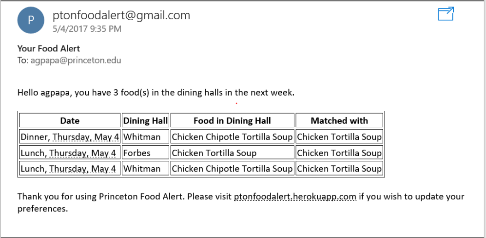

## Princeton Food Alert
Everyone has favorite foods. Food can get people up in the morning, brighten up a long day, and remind people of home. But with Princeton serving hundreds of food items in over five different dining halls every day, wouldn’t it be great if students could know exactly where and when their favorite foods will be served on campus? Additionally, all upperclassmen get two free swipes per week to use in the dining halls, but with all the different eating options it can be difficult to decide when to use them. Wouldn’t it be great if upperclassmen students could maximize their two weekly meal swipes by knowing exactly where and when the best food of the week will be? Enter Princeton Food Alert, a web-based application that allows students to sign up for alerts when their favorite foods are on the menu and get notifications when the best foods are being served.

For more information about this project, check out our [design document.](https://docs.google.com/a/princeton.edu/document/d/1FFMR6pEkamutO0nOa34wE3rtOTm_xqfbzCitnCA0piM/edit?usp=sharing)

### Meet the team
- Thomas Clark (_thclark_) (fearless leader)
- Antonio Papa (_agpapa_)
- Melana Hammel (_mhammel_)
- Ramon Ayala (_ra4_)
- Ghassen Jerfel (_gjerfel_) (project advisor)

### Timeline
**Week 1:** Build working website allowing users to type in their food preferences  
**Week 2:** Build backend database for storing user food preferences  
**Week 3:** Build scraper for dining services and get menus. Email users whose food preferences are on a menu ← can declare success after this  
**Week 4:** Create options for users to select as an alternative to free typing  
**Week 5:** Create option for users to receive a text message instead of an email  
**Week 6:** Let users select food items only from a specific dining hall (i.e. Whitman chicken pot-pie instead of Forbes chicken pot-pie)  
**If time allows:** Create an updating top 10 list of most desired foods  
**If time allows:** Give users nutritional information for each menu item  
**If time allows:** Recommend food based on what the user already likes  

### Tutorials and Screenshots

When first coming to our website, the user will see a page like this:

By typing in a food into the box, autocomplete suggestions appear. 

Once a food is added, the webpage looks like this:

When the food is in the dining hall, the user will receive an email like this:

Note that an exact match is not required, as long as every word is in the dining hall food item an email will be sent.

Users can also adjust their settings to choose when to get emails and for which dining halls.

There is also a Popular Foods page with the foods most preferred by other users.

Happy eating!